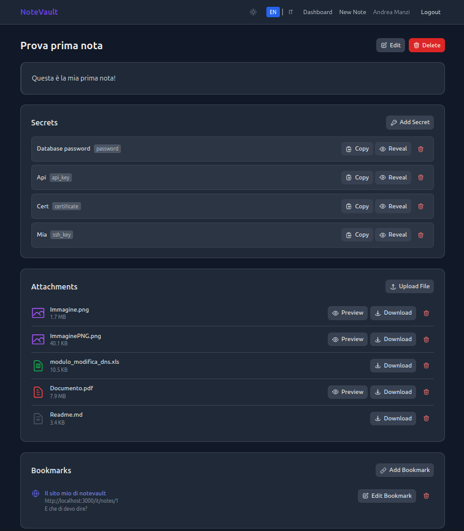

# NoteVault — Knowledge Base Self-Hosted con Segreti Cifrati


[](https://buymeacoffee.com/manzolo)

NoteVault è una **knowledge base self-hosted e multi-utente** che unisce un editor di note in Markdown a una cassaforte per segreti completamente cifrata. Le note sono organizzate con tag, ricercabili tramite la ricerca full-text di PostgreSQL, e possono avere allegati e segnalibri URL. Tutti i valori sensibili sono memorizzati cifrati a riposo con AES-256-GCM. L'intero stack gira in Docker ed è gestito tramite un unico `Makefile`.

---

## Screenshot

### Dashboard — ricerca full-text con corrispondenza in allegato


La barra di ricerca interroga in tempo reale titoli, contenuto, testo estratto dagli allegati, descrizioni, segnalibri e URL. Quando la corrispondenza è trovata all'interno di un file allegato, il nome del file appare come chip cliccabile direttamente nella card del risultato — cliccando **Anteprima** il file si apre inline senza lasciare la pagina.

### Dettaglio nota — segreti, allegati e segnalibri



Ogni nota è uno spazio di lavoro autonomo: corpo in Markdown, cassaforte di segreti cifrati (chiavi API, password, certificati, chiavi SSH…), allegati con anteprima inline e segnalibri URL — tutto su un'unica pagina. I segreti possono essere copiati negli appunti in modo silenzioso (senza mai mostrare il valore sullo schermo) oppure rivelati per 30 secondi, dopodiché vengono nascosti automaticamente.

---

## Indice

- [Funzionalità](#funzionalità)
- [Avvio Rapido](#avvio-rapido)
- [Comandi Make](#comandi-make)
- [Architettura](#architettura)
- [Sicurezza](#sicurezza)
- [Internazionalizzazione](#internazionalizzazione)
- [Panoramica API](#panoramica-api)
- [Variabili d'Ambiente](#variabili-dambiente)
- [Deploy in Produzione](#deploy-in-produzione)
- [Licenza](#licenza)

---

## Funzionalità

- **Multi-utente con autenticazione JWT** — ogni utente dispone di uno spazio di lavoro isolato; i token usano HS256 e scadono dopo 7 giorni.
- **Note con editor Markdown e anteprima live** — scrivi in Markdown e visualizza il risultato renderizzato in tempo reale, affiancato al testo.
- **Tag** — organizza le note liberamente con tag colorati; i tag sono assegnabili anche ad allegati e segnalibri.
- **Ricerca full-text con paginazione** — basata su colonne `tsvector` di PostgreSQL e un indice `GIN`; la ricerca copre titoli, contenuti, testo estratto dagli allegati, descrizioni, segnalibri e URL. I risultati sono paginati.
- **Allegati** — carica file sulle note (PDF, immagini, testo, Markdown, …); il testo viene estratto automaticamente per la ricerca full-text. Ogni allegato può avere una descrizione opzionale e tag.
- **Segnalibri URL** — aggiungi URL segnalibro con titolo, descrizione e tag a qualsiasi nota; i segnalibri sono completamente ricercabili.
- **Cassaforte per segreti cifrati (AES-256-GCM)** — salva chiavi API, password e altri valori sensibili cifrati con AES-256-GCM tramite una `MASTER_KEY` che non viene mai scritta nel database. I segreti di tipo password supportano un campo `username` opzionale (in chiaro).
- **Rivelazione segreti con rate limiting** — i segreti vengono mostrati su richiesta e nascosti automaticamente dopo 30 secondi; l'endpoint di rivelazione è soggetto a rate limiting tramite Redis. È possibile copiare il valore negli appunti senza mai visualizzarlo sullo schermo.
- **Log di audit** — ogni azione viene registrata con timestamp e contesto utente; i valori dei segreti vengono oscurati nei log.
- **Modalità scura** — supporto completo al dark mode in tutte le pagine e componenti.
- **Internazionalizzazione (Italiano + Inglese)** — il frontend include traduzioni complete per `en` e `it`; la lingua è determinata dal prefisso URL (`/en/...`, `/it/...`).
- **Deploy basato su Docker** — lo stack (PostgreSQL, Redis, backend, frontend) è gestito interamente tramite Docker Compose e un `Makefile`.

---

## Avvio Rapido

### Prerequisiti

- Docker >= 24 e Docker Compose v2
- Python 3.x (necessario solo per `make keygen`, utilizza la libreria standard)
- GNU Make

### Procedura

```bash
# 1. Clona il repository
git clone https://github.com/manzolo/notevault.git
cd noteVault

# 2. Genera le chiavi crittografiche
make keygen
# Esempio di output:
#   SECRET_KEY=<valore base64 di 32 byte>
#   MASTER_KEY=<valore base64 di 32 byte>

# 3. Crea il file di configurazione e incolla le chiavi generate
cp .env.example .env
# Modifica .env e inserisci SECRET_KEY, MASTER_KEY, DB_PASSWORD, ecc.

# 4. Costruisci le immagini e avvia tutti i servizi
make build
make up

# 5. Esegui le migrazioni del database
make migrate

# 6. Apri l'applicazione
# http://localhost:3000
```

> **Nota:** Al primo avvio, `make build` compila le immagini del backend e del frontend. Questa operazione può richiedere alcuni minuti. Gli avvii successivi utilizzeranno la cache dei layer Docker.

---

## Comandi Make

Tutte le operazioni quotidiane sono disponibili come target Make. Esegui `make help` per visualizzare l'elenco completo.

### Sviluppo

| Target | Descrizione |
|---|---|
| `build` | (Ri)costruisce le immagini per **sviluppo** (`NEXT_PUBLIC_API_URL=http://localhost:8000`) |
| `up` | Avvia tutti i servizi in modalità detached |
| `down` | Ferma e rimuove i container |
| `restart` | Riavvia tutti i servizi |
| `migrate` | Applica tutte le migrazioni Alembic in attesa |
| `migrate-down` | Annulla l'ultima migrazione Alembic |
| `test` | Esegue l'intera suite di test (backend + frontend) |
| `test-backend` | Esegue la suite pytest del backend |
| `test-frontend` | Esegue la suite Jest/React del frontend in modalità CI |
| `test-e2e` | Esegue i test end-to-end Playwright (richiede lo stack attivo) |
| `logs` | Segue i log di tutti i servizi |
| `logs-backend` | Segue i log del solo servizio backend |
| `shell-backend` | Apre una shell bash nel container del backend |
| `shell-db` | Apre una sessione psql nel container del database |
| `keygen` | Genera i valori `SECRET_KEY` e `MASTER_KEY` |
| `clean` | Rimuove container, volumi e servizi orfani |

### Release & Deploy (Docker Hub)

| Target | Descrizione |
|---|---|
| `build-prod` | Costruisce le immagini per la **produzione** (legge `NEXT_PUBLIC_API_URL` da `.env.deploy`) |
| `tag` | Crea il tag git `vX.Y.Z` e tagga le immagini Docker — `make tag APP_VERSION=1.2.3` |
| `publish` | Pubblica le immagini su Docker Hub e invia il tag git — `make publish APP_VERSION=1.2.3` |
| `deploy` | **Prima installazione**: copia compose + `.env` sul server, scarica le immagini, avvia, migra |
| `deploy-update` | **Aggiornamento**: scarica la nuova versione e riavvia — `make deploy-update APP_VERSION=1.2.3` |

> Le variabili di deploy (`DEPLOY_HOST`, `DEPLOY_PATH`, `NEXT_PUBLIC_API_URL`) vengono lette da `.env.deploy` (gitignored). Vedi [Deploy in Produzione](#deploy-in-produzione).

---

## Architettura

```
┌─────────────────────────────────────────────────────────┐
│                        Browser                          │
└───────────────────────────┬─────────────────────────────┘
                            │ HTTP (via reverse proxy)
┌───────────────────────────▼─────────────────────────────┐
│          Frontend  ·  Next.js 14  ·  :3000              │
│          App Router · TypeScript · Tailwind CSS         │
│          next-intl (en / it) · rewrite /api/* → backend │
└───────────────────────────┬─────────────────────────────┘
                            │ REST API (interna)
┌───────────────────────────▼─────────────────────────────┐
│          Backend  ·  FastAPI  ·  :8000                  │
│          SQLAlchemy async · Migrazioni Alembic          │
│          Cifratura AES-256-GCM · bcrypt 12 iterazioni   │
└────────────┬──────────────────────────┬─────────────────┘
             │                          │
┌────────────▼───────────┐  ┌──────────▼──────────────────┐
│  PostgreSQL 15  :5432  │  │  Redis 7        :6379        │
│  tsvector + indice GIN │  │  Rate limiting · sessioni    │
└────────────────────────┘  └─────────────────────────────┘
```

In produzione, un reverse proxy (es. Nginx Proxy Manager) è posizionato davanti al container frontend. Il server Next.js fa da proxy interno per tutte le richieste `/api/*` verso il backend — il backend non è mai esposto pubblicamente.

---

## Sicurezza

- **Le chiavi non vengono mai registrate** — `SECRET_KEY` e `MASTER_KEY` vengono lette dalle variabili d'ambiente e non vengono mai scritte nei log né nel database.
- **Segreti cifrati a riposo** — ogni valore segreto viene cifrato con AES-256-GCM prima di essere salvato. La `MASTER_KEY` è la radice unica della cifratura; perderla significa perdere l'accesso a tutti i segreti.
- **Valori oscurati nei log di audit** — il log di audit registra eventi e nomi dei segreti, ma i valori vengono sempre sostituiti con `[REDACTED]`.
- **Rate limiting sull'endpoint di rivelazione** — Redis impone un limite di richieste per utente su `POST /api/secrets/{id}/reveal`.
- **Nascondimento automatico dopo 30 secondi** — un timer lato client nasconde automaticamente il valore in chiaro dopo 30 secondi.
- **bcrypt a 12 iterazioni** — le password degli utenti sono sottoposte ad hash con bcrypt con fattore di costo 12.
- **CORS** — il backend accetta richieste solo dalle origini elencate in `CORS_ORIGINS`.
- **Configurazione deploy locale** — le informazioni sul server (`DEPLOY_HOST`, `DEPLOY_PATH`, `NEXT_PUBLIC_API_URL`) risiedono in `.env.deploy`, gitignored e mai committato.

> **Rotazione delle chiavi:** Per ruotare la `MASTER_KEY`, decifrare tutti i segreti con la vecchia chiave, riciclarli con la nuova, aggiornare `.env` e riavviare. Non è presente uno strumento di rotazione automatica nella versione attuale.

---

## Internazionalizzazione

NoteVault utilizza [next-intl](https://next-intl-docs.vercel.app/) con la strategia `localePrefix: 'always'`. Ogni URL di pagina include il codice lingua come primo segmento del percorso.

| Lingua | Prefisso URL | File di traduzione |
|---|---|---|
| Inglese | `/en/...` | `frontend/messages/en.json` |
| Italiano | `/it/...` | `frontend/messages/it.json` |

La lingua predefinita è `en`. Visitare `/` reindirizza automaticamente a `/en/`.

---

## Panoramica API

L'API REST è servita da FastAPI su `http://localhost:8000`. La documentazione interattiva è disponibile su `/docs` (Swagger UI) quando `DEBUG=true`.

| Gruppo di endpoint | Percorso base | Descrizione |
|---|---|---|
| Autenticazione | `/api/auth` | Registrazione, accesso, rinnovo token |
| Note | `/api/notes` | CRUD per le note con paginazione |
| Tag | `/api/tags` | Creazione, elenco, assegnazione tag |
| Ricerca | `/api/search` | Ricerca full-text con paginazione |
| Allegati | `/api/notes/{id}/attachments` | Upload, elenco, stream, eliminazione allegati |
| Segnalibri | `/api/notes/{id}/bookmarks` | CRUD per i segnalibri URL |
| Segreti | `/api/secrets` | CRUD per i segreti cifrati, endpoint di rivelazione |
| Stato database | `/api/database` | Controllo di salute interno usato da Docker |

Tutti gli endpoint protetti richiedono un'intestazione `Authorization: Bearer <token>`.

---

## Variabili d'Ambiente

### Applicazione (`.env`)

Copia `.env.example` in `.env` e compila i valori prima di avviare lo stack.

| Variabile | Obbligatoria | Predefinita | Descrizione |
|---|---|---|---|
| `SECRET_KEY` | **sì** | — | Chiave di 32 byte in base64 per la firma dei token JWT. Generare con `make keygen`. |
| `MASTER_KEY` | **sì** | — | Chiave di 32 byte in base64 per la cifratura AES-256-GCM. Generare con `make keygen`. |
| `DB_PASSWORD` | **sì** | — | Password per l'utente PostgreSQL `notevault`. |
| `DATABASE_URL` | no | impostata da compose | Stringa di connessione SQLAlchemy asincrona. Sovrascritta automaticamente da Docker Compose. |
| `REDIS_URL` | no | `redis://redis:6379/0` | URL di connessione Redis. |
| `CORS_ORIGINS` | no | `http://localhost:3000` | Origini CORS consentite, separate da virgola. In produzione impostare al proprio dominio pubblico. |
| `NEXT_PUBLIC_API_URL` | no | `http://localhost:8000` | **Incorporato nel bundle frontend a build time.** In produzione impostare al dominio pubblico (es. `http://notevault.lan`) tramite `.env.deploy` e usare `make build-prod`. |
| `DEBUG` | no | `false` | Attiva la modalità debug di FastAPI e Swagger UI. Non impostare a `true` in produzione. |

### Configurazione deploy (`.env.deploy`, gitignored)

Copia `.env.deploy.example` in `.env.deploy` e inserisci le informazioni del server. Questo file **non viene mai committato**.

| Variabile | Descrizione |
|---|---|
| `DEPLOY_HOST` | Destinazione SSH, es. `root@your-server.lan` |
| `DEPLOY_PATH` | Percorso assoluto sul server remoto, es. `/root/notevault` |
| `NEXT_PUBLIC_API_URL` | URL pubblico dell'app (incorporato a build time), es. `http://notevault.lan` |

### Variabile di build frontend (incorporata a build time)

| Variabile | Default nel Dockerfile | Descrizione |
|---|---|---|
| `BACKEND_INTERNAL_URL` | `http://notevault-backend:8000` | URL interno usato dal server Next.js per fare da proxy alle richieste `/api/*` verso il backend. Il default è corretto sia per sviluppo che per produzione Docker. |

---

## Deploy in Produzione

Consulta [`docs/DEPLOYMENT.md`](docs/DEPLOYMENT.md) per la guida completa. Riepilogo rapido:

```bash
# 1. Crea .env.deploy con le informazioni del server (gitignored)
cp .env.deploy.example .env.deploy
# Modifica: DEPLOY_HOST, DEPLOY_PATH, NEXT_PUBLIC_API_URL

# 2. Crea il .env di produzione sul server (copia da .env.prod.example)
#    Imposta DB_PASSWORD, SECRET_KEY, MASTER_KEY, CORS_ORIGINS robusti

# 3. Costruisci, tagga e pubblica su Docker Hub
make build-prod
make tag APP_VERSION=1.0.0
make publish APP_VERSION=1.0.0

# 4. Prima installazione (copia compose + .env, scarica immagini, avvia, migra)
make deploy

# 5. Release successive
make build-prod && make tag APP_VERSION=1.1.0 && make publish APP_VERSION=1.1.0
make deploy-update APP_VERSION=1.1.0
```

---

## Licenza

Questo progetto è rilasciato sotto la [Licenza MIT](LICENSE).

---

*Realizzato con FastAPI, Next.js, PostgreSQL e Redis.*
