# NoteVault — Self-hosted Knowledge Base with Encrypted Secrets


[](https://buymeacoffee.com/manzolo)

NoteVault is a **self-hosted, multi-user knowledge base** that combines a WYSIWYG Markdown editor with a fully encrypted secrets vault, file attachments, tasks, a calendar, and powerful full-text search — all running in Docker.

---

## Table of Contents

- [Features at a Glance](#features-at-a-glance)
- [Feature Showcase](#feature-showcase)
  - [Dashboard & Filters](#dashboard--filters)
  - [Note Editor](#note-editor)
  - [Folders & Organisation](#folders--organisation)
  - [Full-Text Search](#full-text-search)
  - [Attachments](#attachments)
  - [Tasks & Reminders](#tasks--reminders)
  - [Calendar & Events](#calendar--events)
  - [Bookmarks](#bookmarks)
  - [Technical Fields](#technical-fields)
  - [Notifications](#notifications)
  - [Wiki-links](#wiki-links)
  - [Note Sharing](#note-sharing)
  - [Encrypted Secrets Vault](#encrypted-secrets-vault)
  - [Two-Factor Authentication (TOTP)](#two-factor-authentication-totp)
- [Quick Start](#quick-start)
- [Make Targets](#make-targets)
- [Architecture](#architecture)
- [Security](#security)
- [Internationalisation](#internationalisation)
- [API Overview](#api-overview)
- [Environment Variables](#environment-variables)
- [Production Deploy](#production-deploy)
- [License](#license)

---

## Features at a Glance

| Area | Highlights |
|---|---|
| **Notes** | WYSIWYG editor (TipTap), Markdown storage, tags, folders, pin, archive |
| **Search** | PostgreSQL full-text search across notes, attachments, bookmarks, tasks |
| **Attachments** | Drag & drop, paste (Ctrl+V), ZIP (incl. password-protected), EML, inline preview |
| **Tasks** | Inline checklist per note + global tasks page, due dates, drag-to-reorder, reminders |
| **Calendar** | Events with recurrence rules, multi-day, attached files, reminders; monthly calendar view |
| **Bookmarks** | Per-note URL bookmarks with title/description, archive, drag-to-reorder; virtual bookmarks from secrets/events |
| **Technical Fields** | Structured key→value fields grouped by category; sub-fields: date, link, price, note, image |
| **Notifications** | In-app bell for task/event reminders; snooze with preset or custom duration |
| **Filters** | Tag, date range, folder recursive, pinned-only, archived-only |
| **Wiki-links** | `[[Note title]]` bidirectional links with autocomplete |
| **Sharing** | Public or user-restricted share links, per-section granularity |
| **Secrets** | AES-256-GCM vault: passwords, API keys, SSH keys, TOTP seeds with live codes |
| **2FA** | TOTP two-factor authentication for login |

---

## Feature Showcase

### Dashboard & Filters

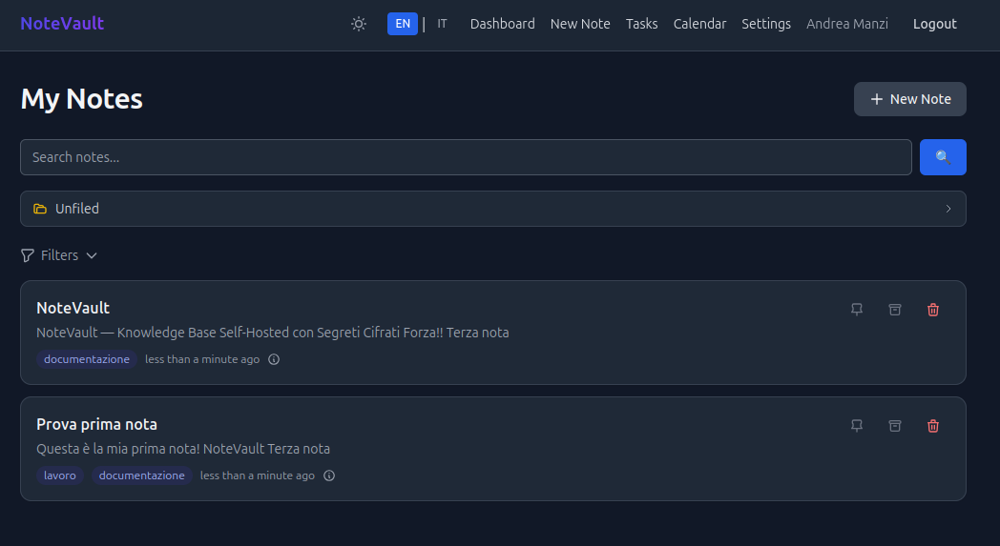

The dashboard lists all your notes with a live **advanced filters panel**. Filters can be combined freely:

- **Tag** — click any tag to narrow results
- **Pinned only** — surface pinned notes at the top
- **Archived only** — browse the archive without cluttering the main view
- **Date range** — filter by creation date or by event dates inside notes
- **Include subfolders** — recursive search across all child folders of the selected folder

Active filters show as dismissible chips even when the panel is collapsed, so you always know what is active.

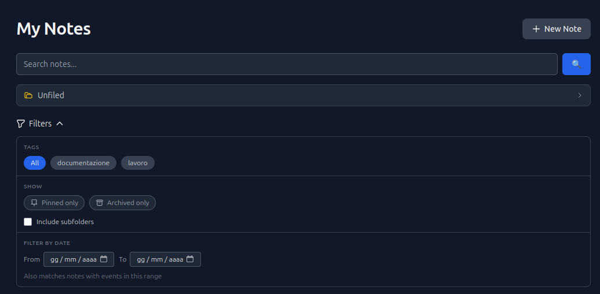

---

### Note Editor

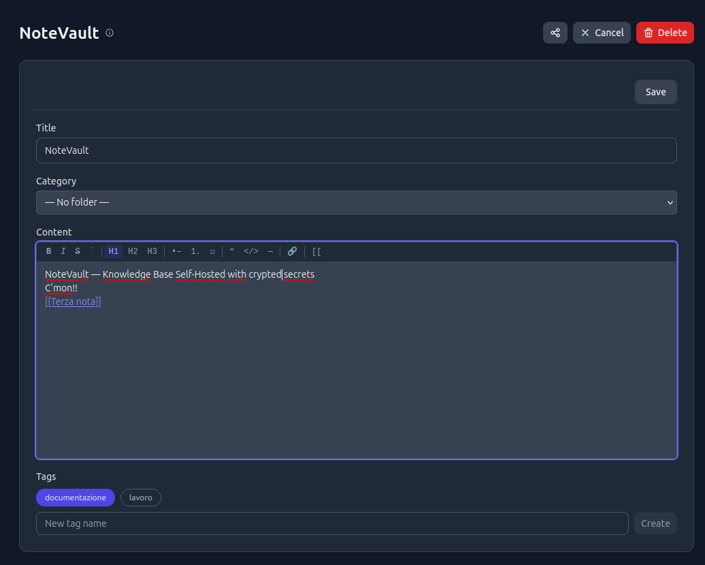

Notes are edited with a full **WYSIWYG TipTap editor** that stores content as plain Markdown. The toolbar includes:

- Bold, italic, strikethrough, inline code
- Headings H1–H3, bullet lists, ordered lists, task lists
- Blockquotes, code blocks, horizontal rules, links
- Wiki-link autocomplete (`[[` triggers a live search dropdown)

Notes can be **pinned** (always sorted first) or **archived** (hidden from the main view, still searchable).

---

### Folders & Organisation

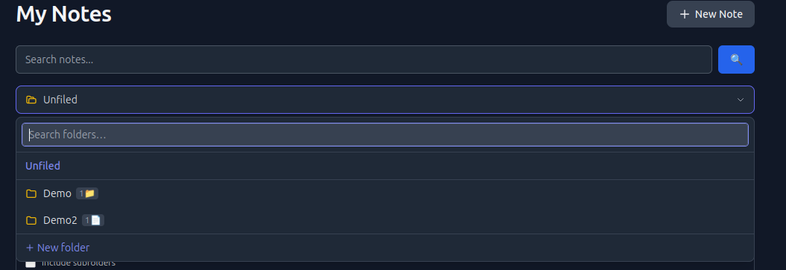

Notes are organised into a **hierarchical folder tree** (unlimited depth). From the sidebar you can:

- Create folders and subfolders
- Rename and delete folders
- **Drag a note card onto a folder** to move it instantly
- Enable *Include subfolders* to search across an entire branch of the tree

---

### Full-Text Search

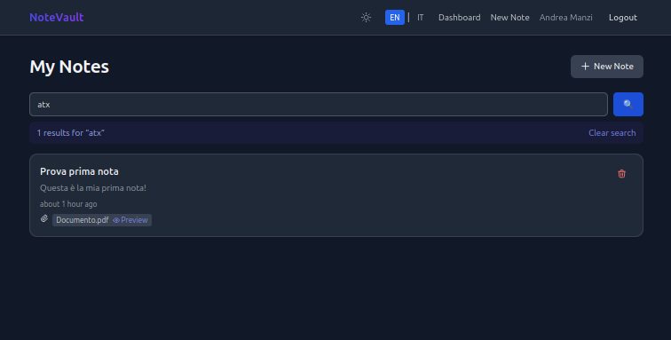

The search bar queries all of your content simultaneously via **PostgreSQL `tsvector` / GIN** full-text indexing:

- Note titles and body text
- Extracted text from file attachments (PDF, plain text, Markdown…)
- Bookmark titles, URLs, and descriptions

When a match is found **inside a file attachment**, the filename appears as a clickable chip in the result card. Click it to open the file inline without leaving the search results page.

---

### Attachments

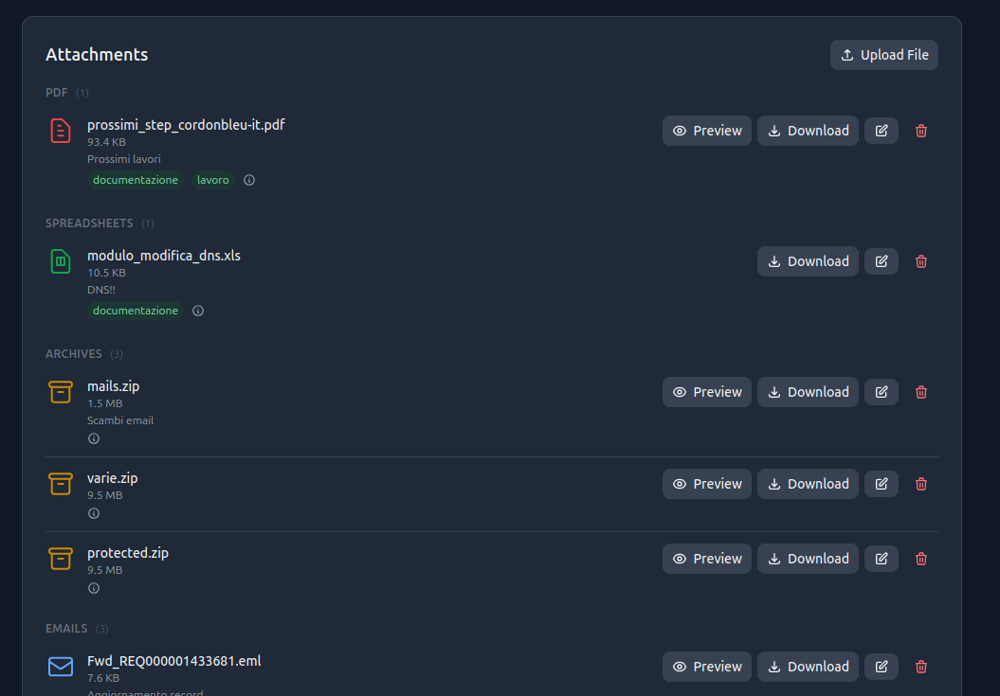

Every note has an **attachments panel** that supports:

- Click to select a file
- **Drag & drop** a file directly onto the note
- **Paste** an image from the clipboard with `Ctrl+V` (saves with a custom filename)

Attachments are grouped by type (images, PDFs, documents, spreadsheets, archives, emails, scripts…). A large range of formats can be previewed inline:

| Format | Preview |
|---|---|
| Images (PNG, JPG, GIF, WebP…) | Rendered directly |
| PDF | Embedded PDF viewer |
| Plain text, Markdown | Syntax-highlighted text |
| ZIP / TAR | File tree with individual entry preview |
| Password-protected ZIP | Unlock with password, then browse/preview entries |
| EML (email) | Rendered HTML body + embedded attachment list with preview |

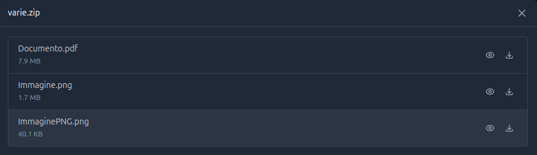

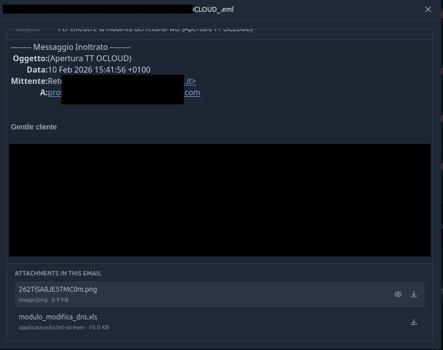

---

### Tasks & Reminders

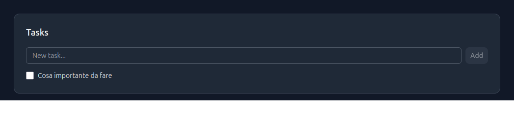

Each note has an **inline task list**: add items, check them off, reorder by drag, set optional due dates. A dedicated **global Tasks page** aggregates all tasks across all notes with a Todo / Done / All filter.

Tasks support **reminders**: set one or more alerts before the due date, delivered via in-app notification, Telegram, or email. Each task can have up to 5 reminders with preset intervals (15 min, 1 h, 1 day, 1 week) or a fully custom duration.

---

### Calendar & Events

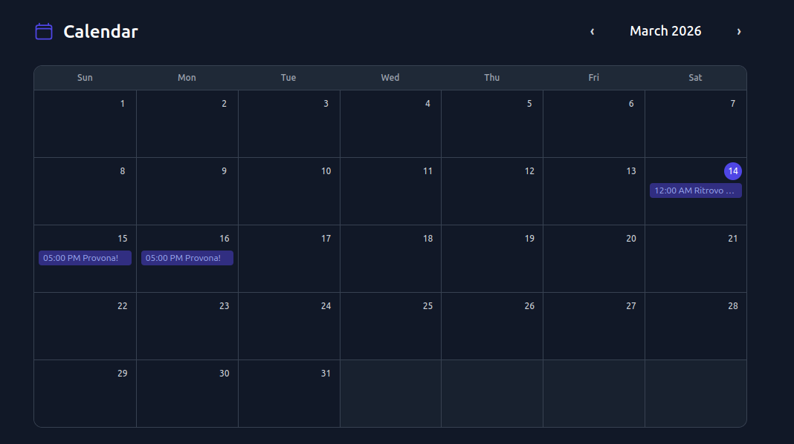

Notes can have **events** with a start datetime, optional end datetime, URL (Google Meet, Zoom…), and attached files. All events appear on a **monthly calendar view** alongside tasks that have due dates. Multi-day events span across days.

The date filter on the dashboard matches notes whose events overlap the selected date range — not just the note creation date.

Events also support **recurrence rules** (daily, weekly, monthly, yearly with optional UNTIL/COUNT limits) and **reminders** with the same multi-channel delivery as tasks.

---

### Bookmarks

Each note has a **bookmarks panel** for saving related URLs with an optional title and description. Bookmarks support drag-to-reorder, archive, and full-text indexing.

**Virtual bookmarks** are automatically derived from secrets and events that contain a URL — they appear as read-only entries in the bookmarks panel with a source badge (amber for secrets, blue for events), keeping all relevant links in one place without duplication.

---

### Technical Fields

Each note can have **structured technical fields** — key → value pairs grouped into named categories. Each field supports optional sub-fields: a date, a URL link, a price, a note, and an image (paste from clipboard or browse). Fields are great for storing structured data like product specs, configuration parameters, or research metadata.

---

### Notifications

A **bell icon** in the top navigation shows unread in-app notifications for task and event reminders. Clicking a notification navigates directly to the relevant note.

Notifications can be **snoozed** — choose a preset (10 min, 30 min, 1 h, 3 h, 8 h, 1 day, 1 week) and the notification disappears until the snooze expires.

---

### Wiki-links

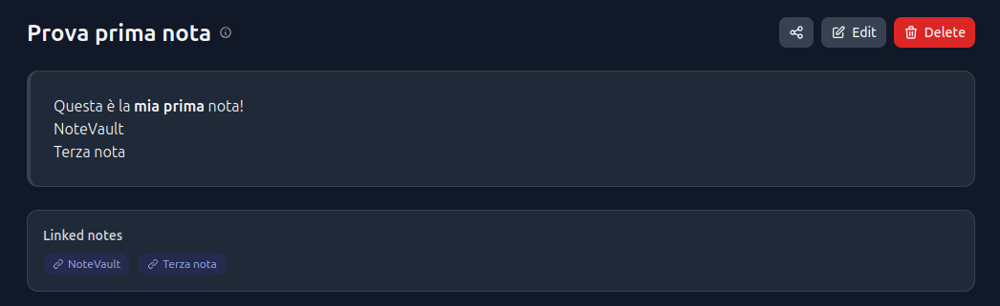

Type `[[` in the editor to trigger a live autocomplete dropdown that searches note titles. Selecting a title inserts a `[[Note title]]` link. In the note view, wiki-links are resolved to clickable links and the note shows:

- **Linked notes** (outbound) — notes this note references
- **Backlinks** (inbound) — notes that reference this one

Links are bidirectional and update automatically on every save.

---

### Note Sharing

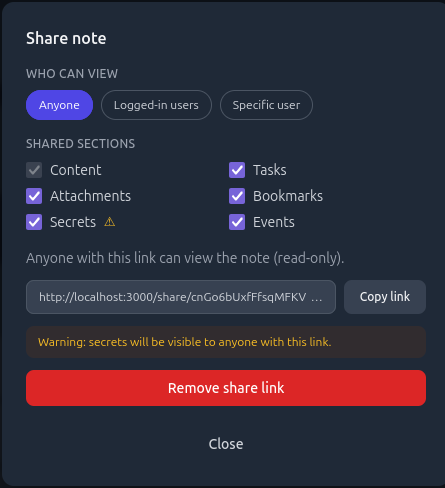

Generate a **share link** for any note. Sharing is configurable:

- **Public** — anyone with the link can view (no login required)
- **Logged-in users only** — requires a NoteVault account
- **Specific user** — only a chosen user can open the link

You choose **which sections** to expose: content, tasks, attachments, bookmarks, events, and optionally secrets. Each section can be toggled independently.

---

### Encrypted Secrets Vault

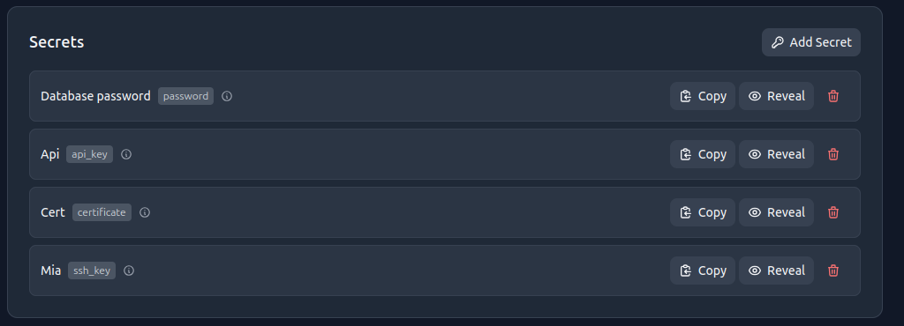

Each note has a **secrets vault** encrypted with AES-256-GCM using a `MASTER_KEY` that never touches the database. Supported secret types:

| Type | Fields |
|---|---|
| Password | username, password, URL |
| API Key | key ID, secret, URL |
| SSH Key | private key, optional public key, host |
| TOTP Seed | Base32 seed → **live OTP code with countdown ring** |

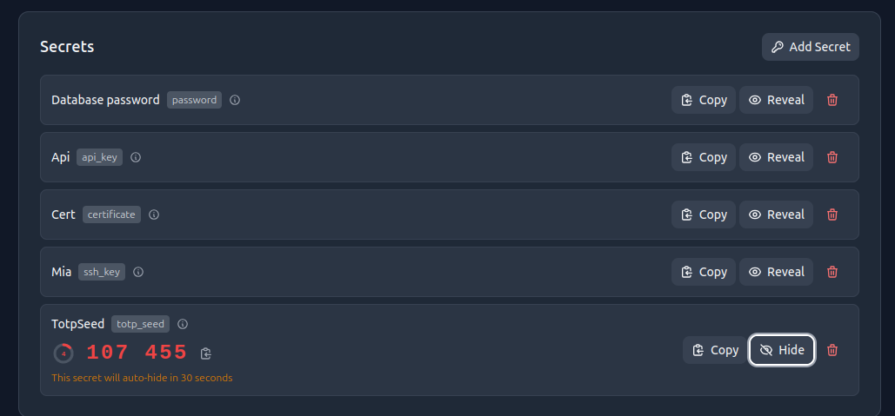

TOTP seeds show a rotating 6-digit code with a 30-second SVG countdown ring, updated in real time. Any secret can be **copied silently** (value never displayed) or **revealed for 30 seconds** before auto-hiding. The reveal endpoint is rate-limited per user via Redis.

---

### Two-Factor Authentication (TOTP)

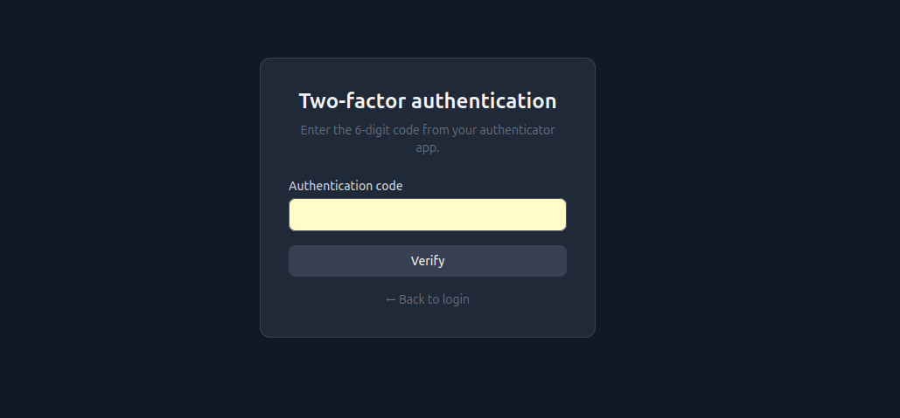

Users can enable **TOTP 2FA** in Settings by scanning a QR code with any authenticator app (Google Authenticator, Aegis, etc.). When 2FA is active, login is a two-step flow: password first, then the 6-digit OTP. The setup can be disabled at any time by entering the current password.

---

## Quick Start

### Prerequisites

- Docker >= 24 and Docker Compose v2
- Python 3.x (only needed for the `make keygen` helper, uses the standard library)
- GNU Make

### Steps

```bash
# 1. Clone the repository
git clone https://github.com/manzolo/notevault.git
cd noteVault

# 2. Generate cryptographic keys
make keygen
# Output example:
#   SECRET_KEY=<base64-encoded 32-byte value>
#   MASTER_KEY=<base64-encoded 32-byte value>

# 3. Create your environment file and paste the generated keys
cp .env.example .env
# Edit .env and fill in SECRET_KEY, MASTER_KEY, DB_PASSWORD, etc.

# 4. Build images and start all services
make build
make up

# 5. Open the application
# http://localhost:3000
```

> **Note:** On first run, `make build` compiles the backend and frontend images. This may take a few minutes. Subsequent builds use Docker's layer cache. Migrations are applied automatically at container startup.

---

## Make Targets

All day-to-day operations are available as Make targets. Run `make help` to see the full list.

### Development

| Target | Description |
|---|---|
| `build` | (Re)build images for **development** |
| `up` | Start all services in detached mode |
| `down` | Stop and remove containers |
| `restart` | Restart all services |
| `migrate` | Apply all pending Alembic migrations |
| `migrate-down` | Roll back the most recent Alembic migration |
| `test-backend` | Run backend pytest suite inside the container |
| `test-e2e` | Run Playwright end-to-end tests (requires running stack) |
| `logs` | Follow logs for all services |
| `logs-backend` | Follow logs for the backend service only |
| `shell-backend` | Open a bash shell inside the backend container |
| `shell-db` | Open a psql session inside the database container |
| `keygen` | Generate `SECRET_KEY` and `MASTER_KEY` values |
| `create-user` | Create a new user interactively (or `USERNAME= EMAIL= PASSWORD= make create-user`) |
| `clean` | Remove containers, volumes, and orphaned services |

### Release & Deployment (Docker Hub)

| Target | Description |
|---|---|
| `build-prod` | Build images for **production** |
| `tag` | Git-tag the commit as `vX.Y.Z` and tag Docker images — `make tag APP_VERSION=1.2.3` |
| `publish` | Push tagged images to Docker Hub and push the git tag — `make publish APP_VERSION=1.2.3` |
| `deploy` | **First-time deploy**: copy compose file + `.env` to server, pull images, start, migrate |
| `deploy-update` | **Rolling update**: pull new image version and restart — `make deploy-update APP_VERSION=1.2.3` |

> Deploy variables (`DEPLOY_HOST`, `DEPLOY_PATH`) are loaded from `.env.deploy` (gitignored). See [Production Deploy](#production-deploy).

---

## User Management

Registration is **disabled by default** (`REGISTRATION_ENABLED=false`). This is the recommended setting for internet-facing deployments. Use `make create-user` to provision accounts:

```bash
# Interactive — prompts for username, email, password
make create-user

# Non-interactive (useful for scripts)
make create-user USERNAME=alice EMAIL=alice@example.com PASSWORD=s3cr3tPass!
```

To allow self-registration temporarily (e.g. during initial setup on intranet), set `REGISTRATION_ENABLED=true` in `.env`, restart the backend, then disable it again once accounts are created.

---

## Architecture

```
┌─────────────────────────────────────────────────────────┐
│                        Browser                          │
└───────────────────────────┬─────────────────────────────┘
                            │ HTTP (via reverse proxy)
┌───────────────────────────▼─────────────────────────────┐
│          Frontend  ·  Next.js 14  ·  Node 22  ·  :3000  │
│          App Router · TypeScript · Tailwind CSS         │
│          next-intl (en / it) · /api/* rewrite → backend │
└───────────────────────────┬─────────────────────────────┘
                            │ REST API (internal)
┌───────────────────────────▼─────────────────────────────┐
│          Backend  ·  FastAPI  ·  Python 3.12  ·  :8000  │
│          SQLAlchemy async · Alembic migrations          │
│          AES-256-GCM encryption · bcrypt 12 rounds      │
│          APScheduler (reminder delivery)                │
└────────────┬──────────────────────────┬─────────────────┘
             │                          │
┌────────────▼───────────┐  ┌──────────▼──────────────────┐
│  PostgreSQL 17  :5432  │  │  Redis 7        :6379        │
│  tsvector + GIN index  │  │  Rate limiting · sessions    │
└────────────────────────┘  └─────────────────────────────┘
```

In production, a reverse proxy (e.g. Nginx Proxy Manager) sits in front of the frontend container. The frontend's Next.js server proxies all `/api/*` requests internally to the backend — the backend is never exposed publicly.

---

## Security

- **Keys never logged** — `SECRET_KEY` and `MASTER_KEY` are read from environment variables and never written to application logs or the database.
- **Secrets encrypted at rest** — every secret value is encrypted with AES-256-GCM before persisting. The `MASTER_KEY` is the sole encryption root; losing it means losing access to all secrets.
- **Secret values redacted in audit logs** — the audit log records events and secret names, but values are always replaced with `[REDACTED]`.
- **Rate limiting on the reveal endpoint** — Redis enforces a per-user rate limit on secret reveal.
- **Auto-hide after 30 seconds** — once a secret is revealed in the UI, a client-side timer hides the plaintext automatically.
- **bcrypt 12 rounds** — user passwords are hashed with bcrypt at cost factor 12.
- **TOTP 2FA** — optional two-factor authentication for login.
- **CORS** — the backend accepts requests only from origins listed in `CORS_ORIGINS`.

> **Key rotation:** To rotate `MASTER_KEY`, decrypt all secrets with the old key, re-encrypt with the new key, and update `.env` before restarting. There is no automated rotation tool in the current release.

---

## Internationalisation

NoteVault uses [next-intl](https://next-intl-docs.vercel.app/) with `localePrefix: 'always'`. Every page URL includes the locale as the first path segment.

| Locale | URL prefix | Translation file |
|---|---|---|
| English | `/en/...` | `frontend/messages/en.json` |
| Italian | `/it/...` | `frontend/messages/it.json` |

The default locale is `en`. Visiting `/` redirects to `/en/`.

---

## API Overview

The REST API is served by FastAPI at `http://localhost:8000`. Interactive documentation is available at `/docs` (Swagger UI) when `DEBUG=true`.

| Endpoint group | Base path | Description |
|---|---|---|
| Authentication | `/api/auth` | Register, login, TOTP verify, 2FA setup |
| Notes | `/api/notes` | CRUD, pin, archive, wiki-link resolve, backlinks |
| Tags | `/api/tags` | Create, list, assign tags |
| Categories | `/api/categories` | Folder CRUD |
| Search | `/api/search` | Full-text search across notes, attachments, bookmarks, tasks |
| Attachments | `/api/notes/{id}/attachments` | Upload, stream, ZIP/EML preview, delete |
| Bookmarks | `/api/notes/{id}/bookmarks` | CRUD, archive, restore, reorder |
| Secrets | `/api/secrets` | CRUD, reveal, copy-silent, TOTP seeds |
| Tasks | `/api/tasks` | Per-note tasks + global task list, reorder, archive |
| Task reminders | `/api/tasks/{id}/reminders` | CRUD for per-task reminder schedules |
| Events | `/api/notes/{id}/events` | CRUD for calendar events with recurrence |
| Event reminders | `/api/events/{id}/reminders` | CRUD for per-event reminder schedules |
| Technical fields | `/api/notes/{id}/fields` | CRUD, reorder for structured key→value fields |
| Field dates | `/api/field-dates` | Calendar aggregation of date-type fields |
| Notifications | `/api/notifications` | List, mark-read, snooze |
| Share | `/api/notes/{id}/share` | Create/revoke share tokens; public share view |

All protected endpoints require an `Authorization: Bearer <token>` header.

---

## Environment Variables

### Application (`.env`)

Copy `.env.example` to `.env` and populate before starting the stack.

| Variable | Required | Default | Description |
|---|---|---|---|
| `SECRET_KEY` | **yes** | — | Base64-encoded 32-byte key for JWT signing. Generate with `make keygen`. |
| `MASTER_KEY` | **yes** | — | Base64-encoded 32-byte key for AES-256-GCM secret encryption. Generate with `make keygen`. |
| `DB_PASSWORD` | **yes** | — | Password for the `notevault` PostgreSQL user. |
| `DATABASE_URL` | no | set by compose | Full async SQLAlchemy connection string. Set automatically by Docker Compose. |
| `REDIS_URL` | no | `redis://redis:6379/0` | Redis connection URL. |
| `CORS_ORIGINS` | no | `http://localhost:3000` | Comma-separated allowed CORS origins. In production set to your public domain. |
| `CORS_ALLOWED_METHODS` | no | `GET,POST,PUT,PATCH,DELETE,OPTIONS` | Comma-separated HTTP methods allowed by CORS. |
| `CORS_ALLOWED_HEADERS` | no | `Content-Type,Authorization` | Comma-separated request headers allowed by CORS. |
| `NEXT_PUBLIC_API_URL` | no | `/api` | **Baked into the frontend bundle at build time.** Defaults to `/api` (domain-agnostic). Only set for cross-origin setups. |
| `DEBUG` | no | `false` | Enable FastAPI debug mode and Swagger UI. Must be `false` in production. |
| `TOTP_REQUIRED` | no | `false` | Require TOTP 2FA for all users at login. |
| `REGISTRATION_ENABLED` | no | `false` | Allow new users to self-register. Set to `true` only when public sign-up is desired; leave `false` and use `make create-user` to provision accounts manually. |

### Deploy configuration (`.env.deploy`, gitignored)

Copy `.env.deploy.example` to `.env.deploy` and fill in your server details.

| Variable | Description |
|---|---|
| `DEPLOY_HOST` | SSH target, e.g. `root@your-server.lan` |
| `DEPLOY_PATH` | Absolute path on the remote host, e.g. `/root/notevault` |
| `NEXT_PUBLIC_API_URL` | Optional — only for cross-origin setups. |

---

## Production Deploy

See [`docs/DEPLOYMENT.md`](docs/DEPLOYMENT.md) for the full guide. Quick summary:

```bash
# 1. Create .env.deploy with your server info (gitignored)
cp .env.deploy.example .env.deploy
# Edit: DEPLOY_HOST, DEPLOY_PATH

# 2. Create production .env on your server (copy from .env.prod.example)
#    Set strong DB_PASSWORD, SECRET_KEY, MASTER_KEY, CORS_ORIGINS

# 3. Build, tag, publish to Docker Hub
make build-prod
make tag APP_VERSION=1.0.0
make publish APP_VERSION=1.0.0

# 4. First-time deploy (copies compose + .env, pulls images, starts, migrates)
make deploy

# 5. Future releases
make build-prod && make tag APP_VERSION=1.1.0 && make publish APP_VERSION=1.1.0
make deploy-update APP_VERSION=1.1.0
```

---

## License

This project is released under the [MIT License](LICENSE).

---

*Built with FastAPI, Next.js, PostgreSQL, and Redis.*
